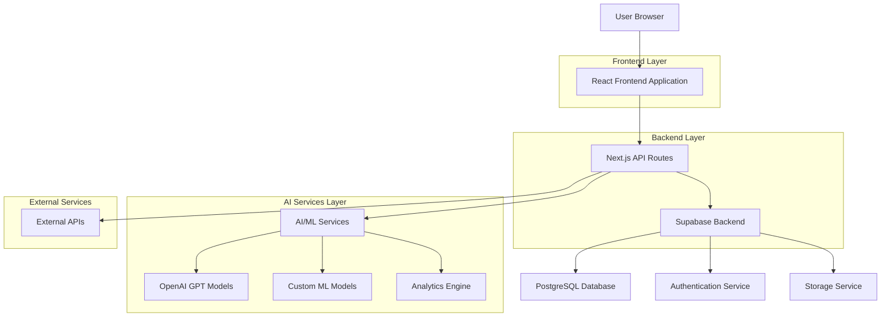

# Technical Architecture Document: AI Super-Agent Platform

## 1. Architecture Design



## 2. Technology Description

**Frontend Stack:**
- React@18 + Next.js@14 for server-side rendering and optimal performance
- TypeScript@5 for type safety and better development experience
- TailwindCSS@3 for responsive, utility-first styling
- Framer Motion for smooth animations and micro-interactions
- React Query for efficient data fetching and caching
- Zustand for lightweight state management

**Backend & Infrastructure:**
- Next.js API Routes for backend API endpoints
- Supabase for authentication, database, and storage
- PostgreSQL for relational data storage
- Redis for caching and session management
- Vercel for hosting and deployment

**AI/ML Services:**
- OpenAI GPT-4 for natural language processing and insights generation
- Custom ML models for predictive analytics and forecasting
- Hugging Face Transformers for specialized NLP tasks
- Python FastAPI microservices for complex ML operations

**Development Tools:**
- Initialization Tool: `create-next-app` with TypeScript template
- Package Manager: pnpm for efficient dependency management
- Code Quality: ESLint, Prettier, Husky for pre-commit hooks
- Testing: Jest, React Testing Library, Cypress for E2E testing

## 3. Route Definitions

| Route | Purpose | Authentication |
|-------|---------|----------------|
| `/` | Landing page with hero section and testimonials | Public |
| `/auth/login` | User login page | Public |
| `/auth/register` | User registration with company validation | Public |
| `/dashboard` | Main dashboard with analytics overview | Protected |
| `/insights` | AI insights hub with query interface | Protected |
| `/workflows` | Workflow automation builder | Protected |
| `/analytics` | Advanced analytics and reporting | Protected |
| `/team` | Team management and collaboration | Protected |
| `/settings` | User and platform settings | Protected |
| `/api/auth/*` | Authentication endpoints | Public |
| `/api/insights/*` | AI insights generation APIs | Protected |
| `/api/workflows/*` | Workflow management APIs | Protected |
| `/api/analytics/*` | Analytics data APIs | Protected |

## 4. API Definitions

### 4.1 Authentication APIs

**User Registration**
```
POST /api/auth/register
```

Request:
```json
{
  "email": "user@company.com",
  "password": "secure_password",
  "company_name": "Example Corp",
  "role": "brand_manager",
  "phone": "+1234567890"
}
```

Response:
```json
{
  "user_id": "uuid",
  "email": "user@company.com",
  "company_id": "uuid",
  "role": "brand_manager",
  "access_token": "jwt_token",
  "refresh_token": "refresh_token"
}
```

**User Login**
```
POST /api/auth/login
```

Request:
```json
{
  "email": "user@company.com",
  "password": "secure_password"
}
```

Response:
```json
{
  "user_id": "uuid",
  "email": "user@company.com",
  "company_id": "uuid",
  "role": "brand_manager",
  "access_token": "jwt_token",
  "refresh_token": "refresh_token"
}
```

### 4.2 Insights APIs

**Generate AI Insights**
```
POST /api/insights/generate
```

Request:
```json
{
  "query": "Why did our sales drop in Q2?",
  "context": {
    "time_range": "2024-04-01 to 2024-06-30",
    "product_categories": ["beverages", "snacks"],
    "regions": ["north_america", "europe"]
  },
  "output_format": "detailed"
}
```

Response:
```json
{
  "insight_id": "uuid",
  "query": "Why did our sales drop in Q2?",
  "insights": [
    {
      "type": "root_cause",
      "title": "Seasonal Demand Shift",
      "description": "Sales dropped 15% due to unusual weather patterns affecting beverage consumption",
      "confidence_score": 0.85,
      "supporting_data": {
        "metrics": [{"name": "temperature", "correlation": -0.73}],
        "visualizations": ["chart_id_1", "chart_id_2"]