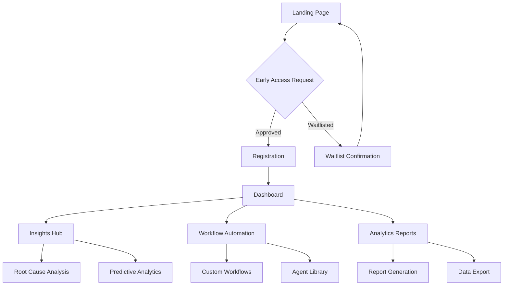

# Product Requirements Document: AI Super-Agent Platform for Consumer Brands

## 1. Product Overview

This document outlines the requirements for building an AI-powered platform similar to CalvinBall Technologies' KJAI Super-Agent. The platform will serve consumer brands by providing intelligent automation, predictive analytics, and expert-driven insights to streamline business operations and enhance decision-making.

The platform addresses the core problem: AI solutions often lack industry context and brand-specific workflows, making them ineffective for enterprise use. Our solution combines artificial intelligence with human expertise to deliver contextual, actionable insights for consumer brands.

**Target Market**: Consumer brands, enterprises, and marketing teams seeking AI-powered business intelligence and automation.

## 2. Core Features

### 2.1 User Roles

| Role | Registration Method | Core Permissions |
|------|---------------------|------------------|
| Brand Manager | Email registration + company verification | Full platform access, team management, custom workflows |
| Marketing Analyst | Email registration + team invitation | Analytics access, report generation, data visualization |
| Executive/Decision Maker | Email registration + company verification | Dashboard access, high-level insights, strategic reports |
| Admin | Manual setup | Platform configuration, user management, system settings |

### 2.2 Feature Module

Our AI Super-Agent platform consists of the following main pages:

1. **Landing Page**: Hero section, value proposition, customer testimonials, early access signup
2. **Dashboard**: Real-time analytics, KPI overview, alert notifications, quick actions
3. **Insights Hub**: AI-generated insights, trend analysis, predictive recommendations
4. **Workflow Automation**: Custom workflow builder, agent configuration, task automation
5. **Analytics & Reports**: Data visualization, custom reports, export functionality
6. **Team Management**: User roles, permissions, team collaboration features
7. **Settings & Configuration**: Platform settings, integrations, security preferences

### 2.3 Page Details

| Page Name | Module Name | Feature Description |
|-----------|-------------|---------------------|
| Landing Page | Hero Section | Animated hero banner with value proposition, CTA for early access |
| Landing Page | Customer Testimonials | Video testimonials from enterprise clients, rotating carousel |
| Landing Page | Features Showcase | Interactive demonstration of AI capabilities and benefits |
| Landing Page | Early Access Form | Lead capture form with company validation and waitlist management |
| Dashboard | Real-time Analytics | Live data visualization, customizable widgets, drag-and-drop layout |
| Dashboard | Alert System | Configurable alerts for anomalies, threshold breaches, opportunities |
| Dashboard | Quick Actions | One-click access to common workflows and report generation |
| Insights Hub | AI Insights Engine | Natural language query interface, contextual recommendations |
| Insights Hub | Root Cause Analysis | Automated investigation of performance issues and anomalies |
| Insights Hub | Predictive Analytics | Forecasting models, scenario planning, risk assessment |
| Workflow Automation | Visual Builder | Drag-and-drop workflow designer with conditional logic |
| Workflow Automation | Agent Library | Pre-built AI agents for common business functions |
| Workflow Automation | Integration Hub | Connect to existing tools, APIs, and data sources |
| Analytics & Reports | Custom Reports | Report builder with templates, scheduling, and sharing |
| Analytics & Reports | Data Export | Multiple format exports (PDF, Excel, CSV, API access) |
| Team Management | User Management | Invite team members, role assignment, permission controls |
| Team Management | Collaboration | Shared workspaces, commenting, approval workflows |
| Settings | Platform Configuration | Brand customization, notification preferences, security settings |
| Settings | Integration Settings | API key management, webhook configuration, data source setup |

## 3. Core Process

### User Journey Flow

**New User Flow:**
1. Visitor lands on homepage → Views value proposition and testimonials
2. Clicks "Get Early Access" → Fills out qualification form
3. System validates company information → Adds to waitlist or grants access
4. Receives onboarding email → Sets up account and team
5. Completes platform tour → Configures first workflow
6. Starts using AI insights → Gradually expands usage

**Active User Flow:**
1. Logs into dashboard → Reviews overnight alerts and insights
2. Investigates anomalies → Uses root cause analysis tools
3. Generates reports → Shares findings with stakeholders
4. Configures new workflows → Automates routine tasks
5. Monitors performance → Adjusts strategies based on AI recommendations

## 4. User Interface Design

### 4.1 Design Style

**Visual Identity:**
- **Primary Colors**: Deep purple (#6B46C1) for primary actions, electric blue (#3B82F6) for accents
- **Secondary Colors**: Slate gray (#64748B) for text, light gray (#F1F5F9) for backgrounds
- **Button Style**: Rounded corners (8px radius), subtle shadows, gradient hover effects
- **Typography**: Inter font family, 16px base size, hierarchical sizing system
- **Layout**: Card-based design with generous whitespace, responsive grid system
- **Icons**: Modern line icons, consistent stroke width, subtle animations

**Interactive Elements:**
- Smooth transitions (200-300ms ease-in-out)
- Micro-interactions on hover and click
- Loading states with skeleton screens
- Progress indicators for AI processing

### 4.2 Page Design Overview

| Page Name | Module Name | UI Elements |
|-----------|-------------|-------------|
| Landing Page | Hero Section | Full-width gradient background, animated text reveal, floating CTA button with pulse effect |
| Landing Page | Testimonials | Video player cards with play buttons, client logos, rotating carousel with smooth transitions |
| Dashboard | Analytics Grid | Drag-and-drop widget system, real-time data refresh indicators, customizable layouts |
| Dashboard | Alert Panel | Color-coded severity levels, expandable detail cards, quick action buttons |
| Insights Hub | Query Interface | Natural language input with auto-suggestions, voice input option, query history |
| Insights Hub | Results Display | Card-based insight presentation, confidence scores, supporting data visualizations |
| Workflow Builder | Visual Canvas | Infinite canvas with zoom/pan, drag-and-drop nodes, connection lines with labels |
| Reports | Data Tables | Sortable columns, inline filtering, pagination, export dropdown menu |

### 4.3 Responsiveness

**Desktop-First Approach:**
- Optimized for 1920x1080 and 1366x768 resolutions
- Maximum content width of 1440px with centered layout
- Multi-column layouts with sidebar navigation

**Mobile Adaptation:**
- Responsive breakpoints: 768px (tablet), 480px (mobile)
- Collapsible navigation with hamburger menu
- Touch-optimized interactions with larger tap targets
- Simplified card layouts for mobile viewing

**Cross-Platform Compatibility:**
- Chrome, Safari, Firefox, Edge browsers
- iOS and Android mobile browsers
- Progressive Web App capabilities for mobile installation

## 5. Technical Requirements

### 5.1 Performance Requirements
- Page load time: <3 seconds on 3G connection
- API response time: <500ms for standard queries
- Real-time updates: <1 second latency for dashboard widgets
- Concurrent users: Support for 1000+ simultaneous sessions

### 5.2 Security Requirements
- End-to-end encryption for data transmission
- SOC 2 Type II compliance
- GDPR compliance for data privacy
- Multi-factor authentication for all user accounts
- Role-based access control with granular permissions

### 5.3 Integration Requirements
- RESTful API for third-party integrations
- Webhook support for real-time data updates
- Pre-built connectors for common enterprise tools (Salesforce, HubSpot, Tableau)
- CSV/Excel import and export functionality
- Single Sign-On (SSO) support with SAML 2.0 and OAuth 2.0

## 6. Success Metrics

### 6.1 User Engagement
- Daily Active Users (DAU) target: 80% of registered users
- Session duration: Average 15+ minutes per session
- Feature adoption rate: 60% of users utilizing 3+ core features within first month

### 6.2 Business Impact
- Time savings: 40% reduction in manual analysis tasks
- Decision speed: 50% faster time-to-insight for business decisions
- User satisfaction: Net Promoter Score (NPS) of 50+

### 6.3 Technical Performance
- System uptime: 99.9% availability
- Query accuracy: 95%+ accuracy for AI-generated insights
- Data processing: Handle 1M+ data points per minute

## 7. Implementation Phases

### Phase 1: Foundation (Months 1-2)
- Landing page with early access system
- Basic user authentication and registration
- Core dashboard with static widgets
- Basic analytics and reporting

### Phase 2: Core Intelligence (Months 3-4)
- AI insights engine with natural language processing
- Root cause analysis capabilities
- Predictive analytics models
- Basic workflow automation

### Phase 3: Advanced Features (Months 5-6)
- Visual workflow builder
- Advanced integrations with enterprise tools
- Team collaboration features
- Custom report generation

### Phase 4: Enterprise Ready (Months 7-8)
- Advanced security features and compliance
- Scalability improvements
- Performance optimization
- Advanced analytics and monitoring

This PRD provides the foundation for building a comprehensive AI Super-Agent platform that can compete with CalvinBall Technologies while serving the specific needs of consumer brands and enterprises.